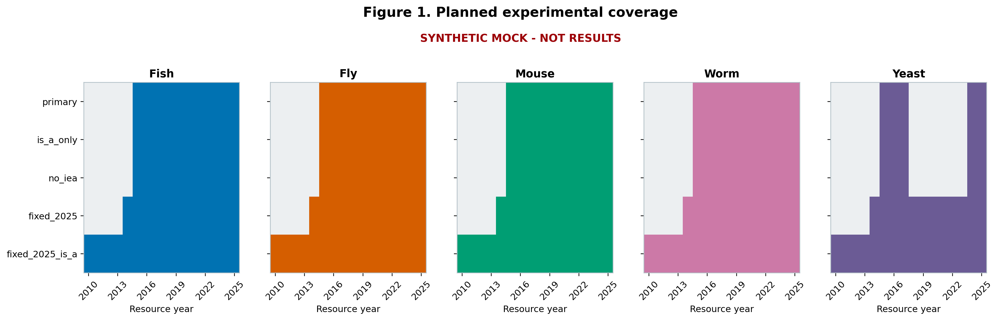
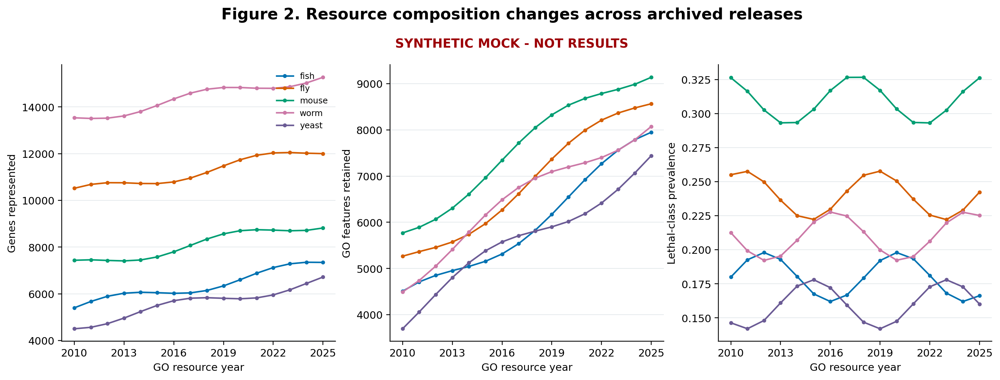
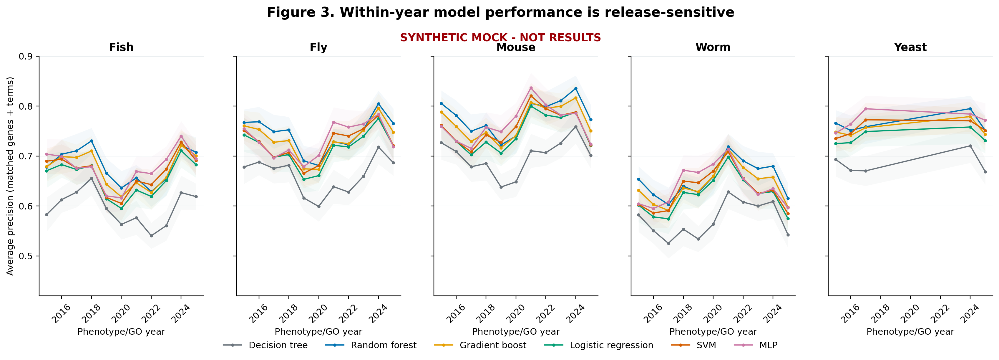
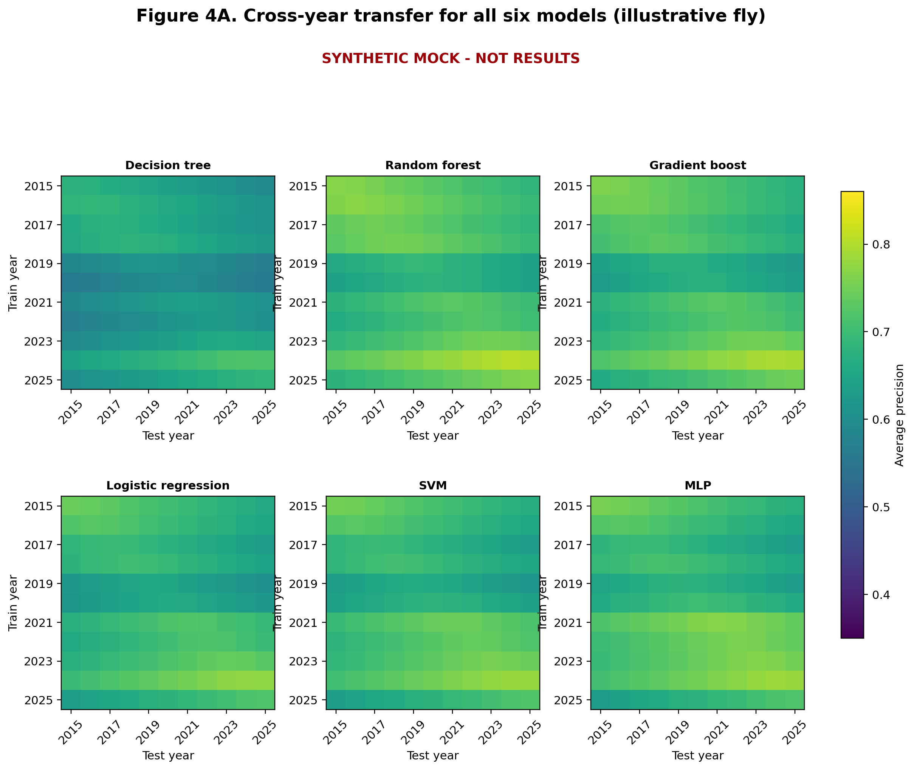
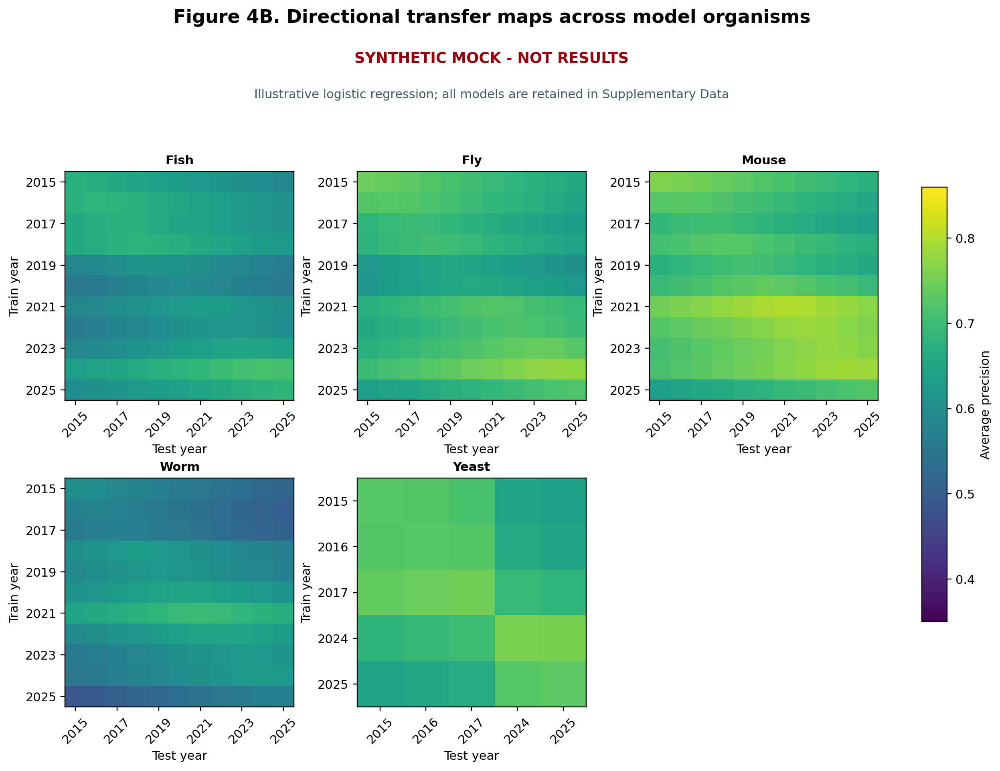
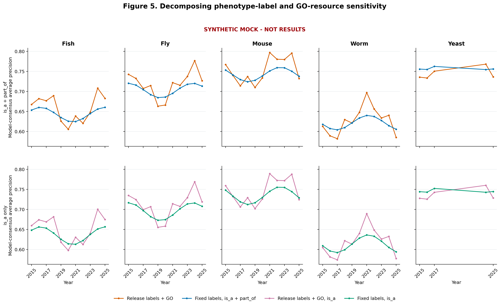
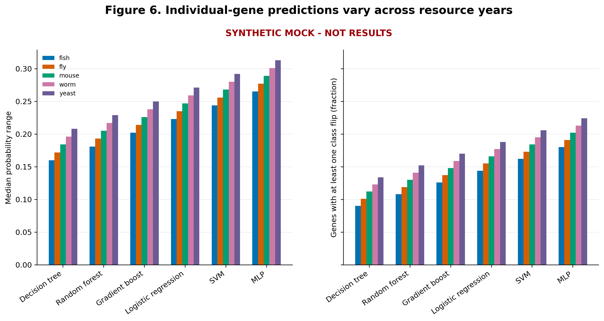
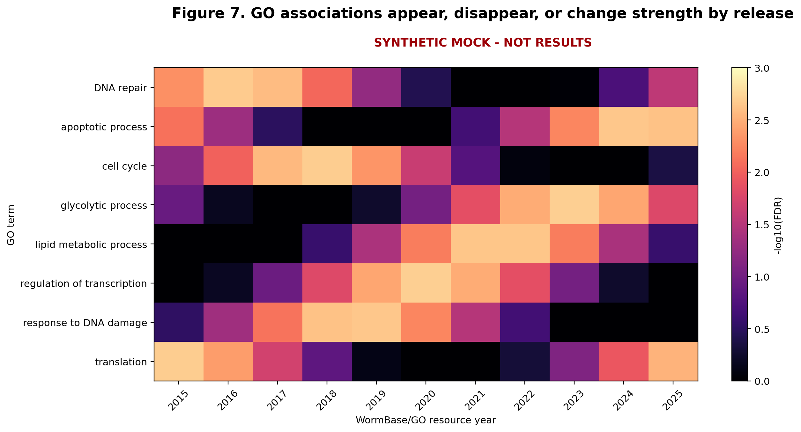

# PhenGO paper-output mock

> **SYNTHETIC MOCK - NOT RESULTS.** Every numerical result in this directory was
> generated deterministically for layout and analysis-design review. No value may
> be quoted as a PhenGO finding.

## What this preview is for

The proposed paper should establish resource change first, then show its effects
on ordinary within-year performance, cross-year transfer, individual predictions,
and GO interpretation. The fixed-label analyses separate phenotype-target change
from GO-resource change. All six model families remain visible; no model or year is
selected after inspecting the result.

## Proposed main-paper figures

1. **Experimental design:** the exact organism, year, and track coverage.
2. **Resource drift:** genes, retained GO terms, annotation volume, prevalence,
   Jaccard overlap, and label churn before any ML result is shown.
3. **Within-year performance:** repeated-CV average precision with uncertainty for
   all six comparable models and every organism-year.
4. **Cross-year transfer:** directional train-year/test-year heatmaps. The main text
   can show one pre-declared model plus an organism overview; all 30 organism-model
   matrices belong in the supplement.
5. **Effect decomposition:** release-matched labels versus fixed 2025 labels over
   the same 2015-2025 interval, with the historical is_a series kept separate.
6. **Prediction instability:** per-gene probability ranges and classification flips.
7. **GO interpretation drift:** complete FDR-corrected timelines, including terms
   that disappear rather than only persistent significant terms.

## Planned track coverage

| Track | Mock snapshots | Year span | GO relations |
| --- | ---: | --- | --- |
| `primary` | 49 | 2015-2025 | is_a;part_of |
| `is_a_only` | 49 | 2015-2025 | is_a |
| `no_iea` | 49 | 2015-2025 | is_a;part_of |
| `fixed_2025` | 60 | 2014-2025 | is_a;part_of |
| `fixed_2025_is_a` | 80 | 2010-2025 | is_a |

## Proposed main-paper tables

| Table | Purpose |
| --- | --- |
| `snapshot_inventory.tsv` | Provenance spine: releases, policies, class counts, feature counts, hashes in the real run. |
| `manuscript_claim_summary.tsv` | Organism-level effect sizes: performance range, far-transfer penalty, and resource overlap. |
| `track_decomposition.tsv` | Same-year comparison of release-derived and fixed-label tracks. |
| `prediction_instability_summary.tsv` | Probability spread and decision flips by organism and model. |

The full tables `within_year_model_performance.tsv`,
`cross_year_transfer_performance.tsv`, `dataset_drift.tsv`, and
`temporal_enrichment_statistics.tsv` are better supplied as Supplementary Data,
with selected rows summarized in the manuscript.

## Visual previews

## Decisions this mock is meant to settle

- Whether average precision and MCC should be co-primary, or average precision
  primary with MCC as a robustness metric.
- Whether Figure 4A should use logistic regression as a pre-declared transparent
  instrument or present a model-consensus matrix.
- Whether the five organism panels belong together in the main paper or as one
  main example plus organism-specific supplements.
- Whether GO-term timelines should be in the main paper or remain secondary to
  the central performance and transfer results.
- How much of the 2010-2013 `is_a` historical extension belongs in the main result,
  given that the directly policy-matched `is_a + part_of` series begins in 2014.
